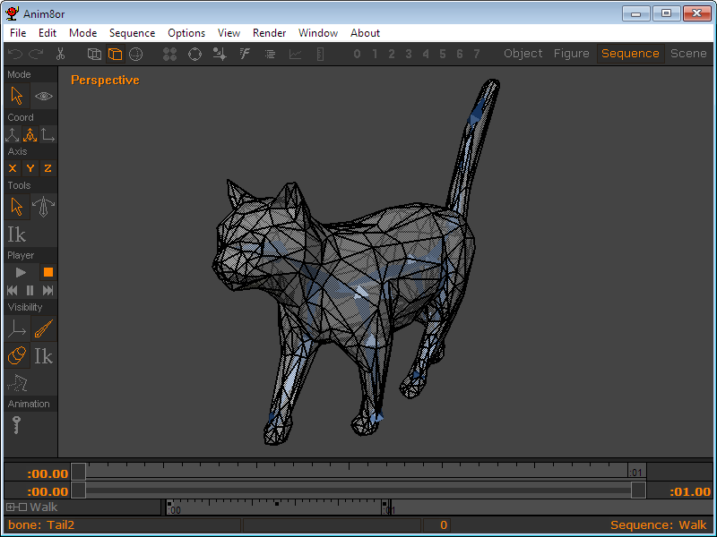
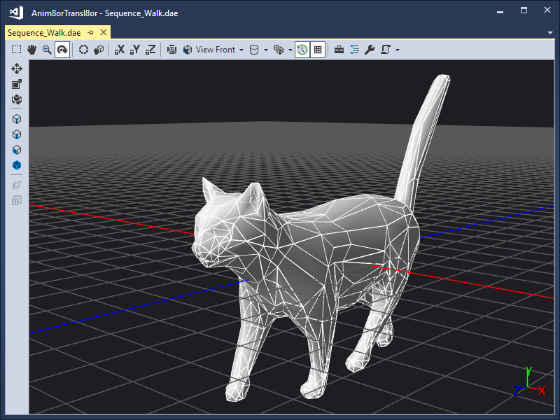

# Anim8or Transl8or
Anim8or Transl8or converts ANIM8OR (\*.an8) files into COLLADA (\*.dae) files.
Download the latest release here:
https://github.com/Enumer8/Anim8orTransl8or/releases.

(For more information on Anim8or®, please visit http://www.anim8or.com/)

(For more information on COLLADA™, please visit
https://www.khronos.org/collada/)

Anim8or Transl8or converts each object, figure, and sequence in an ANIM8OR file
into a separate COLLADA file. For instance, the Walk sequence in Cat.an8:

Becomes Sequence_Walk.dae:

Anim8or Transl8or's output COLLADA files have been informally tested to
"mostly" work with Autodesk® 3ds Max® 2019 and 2023 Student Version
(https://www.autodesk.com/education/free-software/3ds-max), Blender 2.79b
(https://www.blender.org/download/), Unity Personal 2018.3.5
(https://store.unity.com/download?ref=personal) and Microsoft® Visual Studio®
Community 2017 and 2022's Model Editor
(https://docs.microsoft.com/en-us/visualstudio/designers/model-editor?view=vs-2017).
It seems that no two programs have the same level of COLLADA support, and not
all ANIM8OR features are possible to represent in COLLADA, so Anim8or Transl8or
has been carefully designed to create a balance (see
[limitations](#limitations)).

## Prerequisites
As of release 0.7.1, Anim8or Transl8or requires .NET 6.0. It
can be installed from here:
https://dotnet.microsoft.com/en-us/download/dotnet/6.0.

Anim8or Transl8or's GUI will most likely only run on Windows. The CLI should be
able to run on Windows, macOS, and Linux (everywhere that .NET 6.0 can run), but
this is not tested.

## Graphical User Interface (GUI)
1. Double-click Anim8orTransl8or.Gui.exe
1. Browse for the input ANIM8OR (\*.an8) file
1. Choose the path for the output COLLADA (\*.dae) files
1. Click Convert

## Command Line Interface (CLI)
(Cross-platform)
~~~
dotnet Anim8orTransl8or.Cli.dll input.an8 output\
~~~

(Windows specific)
~~~
Anim8orTransl8or.Cli.exe input.an8 output\
~~~

Note: "input.an8" is the name of the input ANIM8OR (\*.an8) file and "output\\"
is the path of the output COLLADA (\*.dae) files.

## Dynamically Linked Library (DLL)
~~~
using Anim8orTransl8or;
using Anim8orTransl8or.An8;
using Anim8orTransl8or.An8.V100;
using Anim8orTransl8or.Dae.V141;
using System;
using System.IO;
using System.Xml.Serialization;

namespace User
{
   class Program
   {
      static void Main(String[] args)
      {
         String inFile = args[0];
         String outFolder = args[1];

         ANIM8OR an8;

         using ( Stream stream = File.Open(inFile, FileMode.Open) )
         {
            An8Serializer deserializer = new An8Serializer(typeof(ANIM8OR));
            an8 = (ANIM8OR)deserializer.Deserialize(stream);
         }

         // One an8 file can result in multiple files
         Directory.CreateDirectory(outFolder);

         foreach ( ConverterResult result in Converter.Convert(an8) )
         {
            String outFile = Path.Combine(outFolder, result.FileName);

            if ( result.Dae != null )
            {
               using ( Stream stream = File.Create(outFile) )
               {
                  XmlSerializer xml = new XmlSerializer(typeof(COLLADA));
                  xml.Serialize(stream, result.Dae);
               }
            }
            else if ( result.Texture != null )
            {
               result.Texture.Save(outFile);
            }
         }
      }
   }
}
~~~

Note: Just add a reference to Anim8orTransl8or.dll to your .NET project.

## Features
 * Parsing ANIM8OR (\*.an8) files that conform to version 1.00 of the specification
 * Parsing/generating COLLADA (\*.dae) files that conform to version 1.4.1 of the specification
 * ANIM8OR "header" converts to COLLADA "author"
 * ANIM8OR "description" converts to COLLADA "comments"
 * ANIM8OR "texture" converts to COLLADA "image"
 * ANIM8OR "material" converts to COLLADA "effect"/"material"
 * ANIM8OR "mesh", "sphere", "cylinder", and "cube" convert to COLLADA "polylist"
 * ANIM8OR "figure" converts to COLLADA "controller"
 * ANIM8OR "sequence" converts to COLLADA "animation"

## Not Yet Supported
 * ANIM8OR "subdivision", "pathcom", "textcom", "modifier", "image", and "morphtarget"
 * ANIM8OR "scene"
 * Two-sided materials
 * Bone degrees of freedom
 * ANIM8OR "C" and "T" floatkey modifiers
 * Configuration/optimization
 * Generating COLLADA (\*.dae) files that conform to version 1.5 of the specification
 * Generating zipped COLLADA (\*.zae) files
 * Generating ANIM8OR (\*.an8) files
 * Converting COLLADA (\*.dae) to ANIM8OR (\*.an8)
 * Converting ANIM8OR (\*.an8) to other formats (such as \*.gltf and \*.glb)

## Limitations
#### Materials
ANIM8OR supports two-sided materials. COLLADA does not natively support this,
but it would be possible to create a duplicate face with a reversed normal. It
could be added as a setting in the future.

ANIM8OR supports some material parameters that do not seem to be supported by
COLLADA (at least in a way that works for most importers). For example, ANIM8OR
has weights that change the percentage of the ambient, diffuse, specular,
and emissive's effect on the final color. These weights work with solid colors
and textures images alike. COLLADA has no way to represent these weights. For
solid colors, Anim8or Transl8or simply multiplies the color by the weight and
stores the result. For texture images, however, Anim8or Transl8or doesn't do
anything. A whole new texture image could be created, but that doesn't seem
practical. It could be added as a setting in the future, though. ANIM8OR also
supports brilliance and phong size parameters. It is not clear if or how they
relate to COLLADA's shininess, reflective, reflectivity, and
index_of_refraction. Anim8or Transl8or assumes phong size is shininess and
ignores brilliance.

###### Blender Specific
COLLADA support transparency, but Blender seems to interpret it incorrectly. In
RGB_ZERO mode, 3ds Max interprets 0 as opaque and 1 as invisible (which seems
correct). Unity agrees, and Model Editor never shows any transparency, so it
doesn't matter. Blender, however, interprets 1 as opaque and 0 as invisible
(which seems incorrect). Unfortunately, Blender users will have to manually fix
the transparency until Blender is updated.

#### Bones
ANIM8OR supports setting the degrees of freedom for each bone. More
investigation into what COLLADA supports is needed.

ANIM8OR supports bones, but COLLADA supports joints. They are almost the same,
but the main difference is that the length of the end bones (think the tips of
fingers, toes, tail, etc.) cannot be represented. They will basically look like
little nubs. There shouldn't be any other detrimental effects.

ANIM8OR allows multiple objects to be attached to any bone in the skeleton. To
maximize compatibility, all objects will be converted to controllers and moved
to the same level as the root joint in the COLLADA file.

###### Blender Specific
When importing into Blender, be sure to check the "Fix Leaf Bones" and "Find
Bone Chains" check boxes. This will help the skeleton look more natural.
Otherwise, all the bones will be pointing upward. The skeleton displays as
expected in 3ds Max.

#### Key Frames
ANIM8OR supports animations by creating individual keys for X, Y, and Z
rotations. These rotations are interpolated independently and seemingly
combined in the X, Z, Y order. COLLADA might support storing the
rotations like this (more investigation is needed), but for now Anim8or
Transl8or creates a complete rotation at every key frame. This helps ensure
maximum compatibility.

COLLADA supports multiple interpolation methods for animations (e.g. LINEAR,
HERMITE, BEZIER, etc.). The ANIM8OR format appears to have some undocumented
fields that may be intended for the same purpose. It doesn't seem possible to
change them from Anim8or v1.00, but it seems that a floatkey modifier "S" is
approximately like COLLADA's HERMITE. Also, the floatkey modifier "C" is
approximately like COLLADA's LINEAR. The floatkey modifier "T" seems to scale a
"S"-like curve and then step change at the end. There does not seem to be a
good parallel in COLLADA. Reverse engineering Anim8or's behavior shows that
there are some strange special cases that don't follow the approximate rules
above. For the above reasons, Anim8or Transl8or uses HERMITE interpolation for
all key frames. Some day the accuracy could be improved.

###### 3ds Max Specific
The converted animations mostly appear correct in Blender and 3ds Max. By
default, 3ds Max seems to use the "Euler X Y Z" rotation controller for
animations. This results in a lot of incorrect rotations. The rotation
controller can be changed by clicking Animation->Rotation
Controllers->Quaternion (TCB). This seems to fix most of the issues, but it is
still possible for an animation to interpolate the exact opposite direction as
expected. More investigation is needed. Blender does not seem to have any
issues.

#### Multiple Objects/Figures/Sequences/Scenes
ANIM8OR can store completely independent objects, figures, sequences, and
scenes in the same file. There doesn't seem to be a good way to do the same in
a COLLADA file. Some possible workarounds, such as combining all sequences into
the same timeline, are not appealing, so Anim8or Transl8or splits each object,
figure, sequence, and scene into a separate COLLADA file. GL Transmission
Format is very promising in this regard (see https://www.khronos.org/gltf/), so
it may be supported as an alternate output format some day.

#### Procedural Meshes
ANIM8OR supports spheres, cylinders, and cubes that are calculated
procedurally. The exact points and texture coordinates, however, are needed
when creating the COLLADA file (and the order of the points must also be exact
if the mesh is explicitly weighted). Anim8or Transl8or's procedure has been
reverse engineered from Anim8or v1.00's output and has been unit tested to
match. However, if there are issues, Anim8or v1.00 can be forced to output the
exact points by selecting the object in Anim8or and clicking Build->Convert to
Mesh. If a specific type of object is not supported by Anim8or Transl8or (i.e.
subdivision, pathcom, textcom, modifier, and image) it can also be enabled by
clicking Convert to Mesh.

#### Implicit Normals
The normals of all ANIM8OR meshes are automatically recalculated even if they
are present in the file. Anim8or Transl8or's calculation has been reverse
engineered from Anim8or v1.00's output and has been unit tested to match.
However, if there are issues, Anim8or v1.00 can be forced to output the exact
normals by clicking Options->Debug->Output Normals.

#### Implicit Weights
ANIM8OR supports weighting points using bone influences. Bone envelopes are
used to internally calculate the point weights. Anim8or Transl8or's calculation
has been reverse engineered from Anim8or v1.00's output and has been unit
tested to match. However, if there are issues, Anim8or v1.00 can be forced to
output the exact weights by double-clicking the figure and choosing Weights
instead of Bone Influences.

## Report Problems
Anim8or Transl8or is immature, the ANIM8OR (\*.an8) format is not completely
documented, and not all COLLADA (\*.dae) importers are perfect, so there will
be problems and incompatibilities. Please enter issues on GitHub
(https://github.com/Enumer8/Anim8orTransl8or/issues). Please don't enter issues
about things that are [not supported yet](#not-supported-yet). For the best
chance at fixing the issue, please attach or link to the ANIM8OR (\*.an8) file
that causes the problem and carefully explain how to recreate the problem.

## Contribute
Anim8or Transl8or is open source software. User contributions are appreciated.
Please create a pull request on GitHub
(https://github.com/Enumer8/Anim8orTransl8or/pulls). Please focus on developing
things that are [not supported yet](#not-supported-yet) and be sure to test
your changes. Visual Studio Community 2017 is recommended for development.
Otherwise, uploading example ANIM8OR files, explaining how to convert something
more accurately, or creating unit tests are also appreciated.

## Acknowledgements
 * Thanks, R. Steven Glanville, for making Anim8or!
 * Thanks, texel3d, for a great reference for ANIM8OR files (https://sourceforge.net/projects/liban8/)
 * Thanks, ThinMatrix, for a great reference for COLLADA files (https://www.youtube.com/watch?v=z0jb1OBw45I)

## Change log
 * Anim8orTransl8or v0.7.3
   * Fixed internationalization issues.
 * Anim8orTransl8or v0.7.2
   * Reverted animation interpolation back to LINEAR from HERMITE. For some reason, it doesn't work in Blender.
 * Anim8orTransl8or v0.7.1
   * Upgraded to .NET 6.0 for cross-platform compatibility
 * Anim8orTransl8or v0.7.0
   * Added support for multiple textures
   * Change animation interpolation from LINEAR to HERMITE
   * Improved material detection accuracy
   * Support for "ambient" chunk instead of just "ambiant" chunk
   * Generated COLLADA file no longer pads zeros
 * Anim8orTransl8or v0.6.0
   * Added conversion for ANIM8OR "texture" and "material"
   * Fixed some issues with Blender compatibility
   * Fixed some issues with sequences getting mixed together
   * Added warning output to the GUI and CLI
   * Calculation of normals should now exactly match Anim8or v1.00
 * Anim8orTransl8or v0.5.0
   * Multiple COLLADA files are created for one ANIM8OR file
   * Calculation of ANIM8OR "sphere", "cylinder", "cube" should now exactly match Anim8or v1.00
   * Calculation of normals are improved, but do not exactly match Anim8or v1.00 yet
   * Calculation of weights should now exactly match Anim8or v1.00
   * Added unit tests for calculation of meshes, normals, and weights
   * Added example ANIM8OR file
 * Anim8orTransl8or v0.4.0
   * Added conversion for ANIM8OR "sequence"
   * Added automatic weight calculation
 * Anim8orTransl8or v0.3.0
   * Added conversion for ANIM8OR "figure"
   * Better parsing of ANIM8OR "weights"
   * Added automatic normal calculation
 * Anim8orTransl8or v0.2.0
   * Added conversion for ANIM8OR "sphere", "cylinder", "cube", and "group"
   * Better parsing of ANIM8OR "sphere", "pathcom", "modifier", and "image"
 * Anim8orTransl8or v0.1.0
   * Added conversion for ANIM8OR "mesh"
